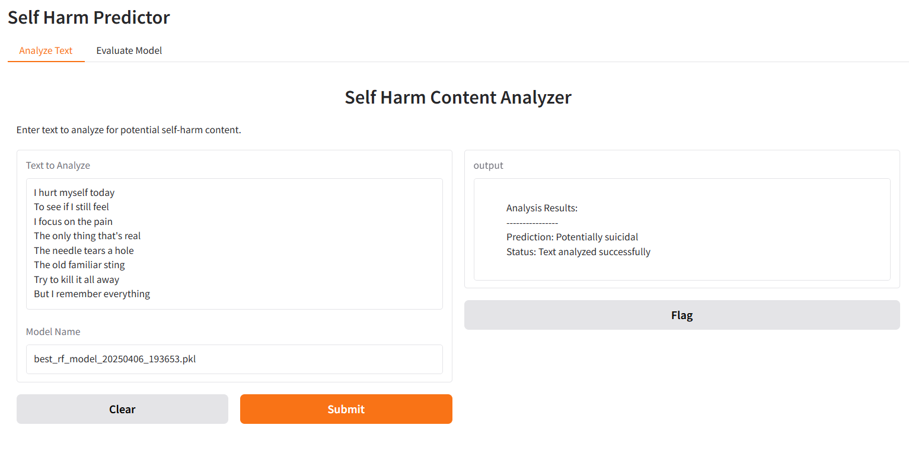

# Self Harm Predictor

A machine learning project that uses Natural Language Processing (NLP) to analyze and predict potential self-harm content from various social media sources.

## Overview

This project combines multiple mental health-related datasets from different sources (Kaggle, Reddit, Twitter) to train a machine learning model that can identify potential self-harm content. The model uses TF-IDF vectorization and Random Forest classification with optimized hyperparameters, exposed through both FastAPI and Gradio interfaces.

## Features

- Data loading from multiple sources (Kaggle, direct URLs)
- Preprocessing of mental health, Reddit, and Twitter datasets
- TF-IDF vectorization for text processing
- Random Forest classifier with GridSearchCV optimization
- Model evaluation with accuracy and classification reports
- Automated training pipeline
- RESTful API endpoints for model training and evaluation
- Interactive Gradio web interface for model training and testing

## Requirements

```txt
kagglehub[pandas-datasets]
scikit-learn
fastapi
uvicorn
gradio
requests
```

## Project Structure

```
self_harm_predictor/
├── app/
│   ├── controllers/
│   │   ├── evaluate_controller.py
│   │   ├── test_controller.py
│   │   └── train_controller.py
│   ├── interfaces/
│   │   ├── evaluate_gradio_interface.py
│   │   ├── test_gradio_interface.py
│   │   └── train_gradio_interface.py
│   └── __init__.py
├── models/
│   ├── SelfHarmDatasetsContainer.py
│   ├── TrainRequest.py
│   └── TrainingResponse.py
├── services/
│   ├── DataLoaderService.py
│   ├── PreprocessorService.py
│   ├── TrainingDataProcessorService.py
│   ├── TrainingPipelineService.py
│   ├── ModelEvaluatorService.py
│   └── UtilityService.py
├── static/
│   └── training_rf_cv_best.txt
├── main.py
└── requirements.txt
```

## Installation

1. Clone the repository:
```bash
git clone https://github.com/yourusername/self_harm_predictor.git
cd self_harm_predictor
```
2. Create a virtual environment (optional but recommended):
```bash
python -m venv venv
source venv/bin/activate  # On Windows use `venv\Scripts\activate`
```

3. Install dependencies:
```bash
pip install -r requirements.txt
```

## Usage

Start the FastAPI server and Gradio interface:

```bash
python main.py
```

The application will be available at:
- FastAPI server: `http://127.0.0.1:8000`
- Gradio interface: `http://127.0.0.1:8000/gradio`

Available endpoints:
- `GET /test` - Test text for self-harm content
- `POST /train` - Train a new model
- `POST /evaluate` - Evaluate the current model

The Gradio interface provides three tabs:
1. **Train Model**: Train a new model with or without cross-validation
2. **Analyze Text**: Test individual text samples for self-harm content
3. **Evaluate Model**: View model performance metrics

## Example of the API usage 

Example evaluation response:


The evaluation endpoint returns detailed metrics including:
- Accuracy score
- Classification report with:
  - Precision
  - Recall
  - F1-score
  - Support
- Per-class metrics for both negative and positive cases

Models and vectorizers are saved in the `snapshots` directory with timestamps:
- Model: `best_rf_model_{timestamp}.pkl`
- Vectorizer: `tfidf_vectorizer_best_rf_model_{timestamp}.pkl`

## Model Performance

The Random Forest classifier is trained using GridSearchCV with the following parameters:
- n_estimators: [100, 200]
- max_depth: [15, 20, None]
- min_samples_split: [2, 5]

Training logs and model performance metrics are saved in the `logs/` directory.

## Dataset Sources

- Mental Health Dataset (Kaggle)
- Reddit Mental Health Data
- Suicidal Tweet Detection Dataset
- Dreaddit Dataset

## Authors

- Mattia Zingaretti - SW Engineer @ [Blue Reply](https://www.reply.com/blue-reply/it) - [LinkedIn](https://www.linkedin.com/in/zingaretti-mattia/)

Contact the authors for any questions or collaboration opportunities.

## License

This project is licensed under the MIT License - see the [LICENSE](LICENSE) file for details.

## Note

This project handles sensitive mental health data and should be used responsibly and ethically.
